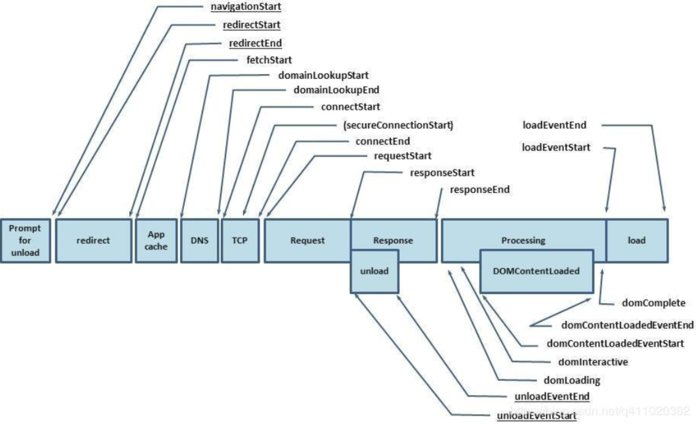
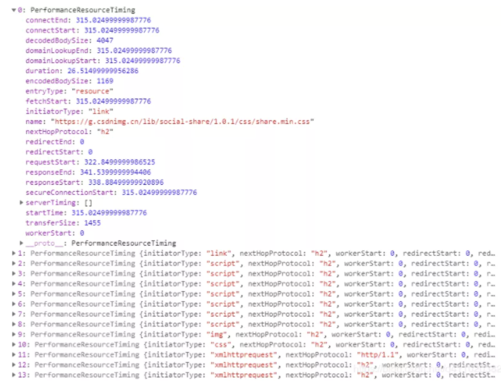

# 前端监控
> 该文档摘录自 [掘金开发者社区 ，作者谭光志](https://juejin.cn/post/6899430989404045320)

前端监控分为性能监控和错误监控。其中监控又分为两个环节：数据采集和数据上报。本文主要讲的就是如何进行数据采集和数据上报。

## 数据采集

### 性能数据采集
性能数据采集需要使用 [window.performance](https://developer.mozilla.org/zh-CN/docs/Web/API/Performance)  API 

```
    let timing = window.performance.timing
    
    {
        // 同一个浏览器上一个页面卸载(unload)结束时的时间戳。如果没有上一个页面，这个值会和fetchStart相同。
        navigationStart: 1543806782096,
        
        // 上一个页面unload事件抛出时的时间戳。如果没有上一个页面，这个值会返回0。
        unloadEventStart: 1543806782523,
        
        // 和 unloadEventStart 相对应，unload事件处理完成时的时间戳。如果没有上一个页面,这个值会返回0。
        unloadEventEnd: 1543806782523,
        
        // 第一个HTTP重定向开始时的时间戳。如果没有重定向，或者重定向中的一个不同源，这个值会返回0。
        redirectStart: 0,
        
        // 最后一个HTTP重定向完成时（也就是说是HTTP响应的最后一个比特直接被收到的时间）的时间戳。
        // 如果没有重定向，或者重定向中的一个不同源，这个值会返回0. 
        redirectEnd: 0,
        
        // 浏览器准备好使用HTTP请求来获取(fetch)文档的时间戳。这个时间点会在检查任何应用缓存之前。
        fetchStart: 1543806782096,
        
        // DNS 域名查询开始的UNIX时间戳。
            //如果使用了持续连接(persistent connection)，或者这个信息存储到了缓存或者本地资源上，这个值将和fetchStart一致。
        domainLookupStart: 1543806782096,
        
        // DNS 域名查询完成的时间.
        //如果使用了本地缓存（即无 DNS 查询）或持久连接，则与 fetchStart 值相等
        domainLookupEnd: 1543806782096,
        
        // HTTP（TCP） 域名查询结束的时间戳。
            //如果使用了持续连接(persistent connection)，或者这个信息存储到了缓存或者本地资源上，这个值将和 fetchStart一致。
        connectStart: 1543806782099,
        
        // HTTP（TCP） 返回浏览器与服务器之间的连接建立时的时间戳。
            // 如果建立的是持久连接，则返回值等同于fetchStart属性的值。连接建立指的是所有握手和认证过程全部结束。
        connectEnd: 1543806782227,
        
        // HTTPS 返回浏览器与服务器开始安全链接的握手时的时间戳。如果当前网页不要求安全连接，则返回0。
        secureConnectionStart: 1543806782162,
        
        // 返回浏览器向服务器发出HTTP请求时（或开始读取本地缓存时）的时间戳。
        requestStart: 1543806782241,
        
        // 返回浏览器从服务器收到（或从本地缓存读取）第一个字节时的时间戳。
            //如果传输层在开始请求之后失败并且连接被重开，该属性将会被数制成新的请求的相对应的发起时间。
        responseStart: 1543806782516,
        
        // 返回浏览器从服务器收到（或从本地缓存读取，或从本地资源读取）最后一个字节时
            //（如果在此之前HTTP连接已经关闭，则返回关闭时）的时间戳。
        responseEnd: 1543806782537,
        
        // 当前网页DOM结构开始解析时（即Document.readyState属性变为“loading”、相应的 readystatechange事件触发时）的时间戳。
        domLoading: 1543806782573,
        
        // 当前网页DOM结构结束解析、开始加载内嵌资源时（即Document.readyState属性变为“interactive”、相应的readystatechange事件触发时）的时间戳。
        domInteractive: 1543806783203,
        
        // 当解析器发送DOMContentLoaded 事件，即所有需要被执行的脚本已经被解析时的时间戳。
        domContentLoadedEventStart: 1543806783203,
        
        // 当所有需要立即执行的脚本已经被执行（不论执行顺序）时的时间戳。
        domContentLoadedEventEnd: 1543806783216,
        
        // 当前文档解析完成，即Document.readyState 变为 'complete'且相对应的readystatechange 被触发时的时间戳
        domComplete: 1543806783796,
        
        // load事件被发送时的时间戳。如果这个事件还未被发送，它的值将会是0。
        loadEventStart: 1543806783796,
        
        // 当load事件结束，即加载事件完成时的时间戳。如果这个事件还未被发送，或者尚未完成，它的值将会是0.
        loadEventEnd: 1543806783802
}
    
```

通过以上数据，我们可以得到几个有用的时间

```
    // 重定向耗时
    redirect: timing.redirectEnd - timing.redirectStart,
    // DOM 渲染耗时
    dom: timing.domComplete - timing.domLoading,
    // 页面加载耗时
    load: timing.loadEventEnd - timing.navigationStart,
    // 页面卸载耗时
    unload: timing.unloadEventEnd - timing.unloadEventStart,
    // 请求耗时
    request: timing.responseEnd - timing.requestStart,
    // 获取性能信息时当前时间
    time: new Date().getTime(),
    // 白屏时间
    whiteScreen: performance.timing.domLoading - performance.timing.navigationStart,
```

另外 通过` window.performance.getEntriesByType('resource') `这个方法，我们还可以获取相关资源（js、css、img...）的加载时间，它会返回页面当前所加载的所有资源


它一般包括以下几个类型：
*   sciprt
*   link
*   img
*   css
*   fetch
*   other
*   xmlhttprequest

我们只需用到以下几个信息：

```
    // 资源的名称
    name: item.name,
    // 资源加载耗时
    duration: item.duration.toFixed(2),
    // 资源大小
    size: item.transferSize,
    // 资源所用协议
    protocol: item.nextHopProtocol,
```

通过对性能及资源信息的解读，我们可以判断出页面加载慢有以下几个原因：

资源过多、过大
网速过慢
DOM 元素过多
除了用户网速过慢，我们没办法之外，其他两个原因都是有办法解决的，性能优化的文章和书籍网上已经有很多了，有兴趣可自行查找资料了解。

PS：其实页面加载慢还有其他原因，例如没有使用按需加载、没有使用 CDN 等等。不过这里我们强调的仅通过对性能和资源信息的解读来获取原因。

## 错误数据采集
目前所能捕捉的错误有三种:

* 资源加载错误，通过 `addEventListener('error', callback, true)` 在捕获阶段捕捉资源加载失败错误。
* js 执行错误，通过 `window.onerror` 捕捉 js 错误。
* promise 错误，通过 `addEventListener('unhandledrejection', callback)`捕捉 promise 错误，但是没有发生错误的行数，列数等信息，只能手动抛出相关错误信息

小结

通过错误收集，可以了解到网站发生错误的类型及数量，从而做出相应的调整，以减少错误发生。完整代码和 DEMO 会在文章末尾放出，大家可以复制代码（HTML文件）在本地测试一下。

## 数据上报
### 性能数据上报
性能数据可以在页面加载完之后上报，尽量不要对页面性能造成影响。

### 错误数据上报
可以在错误发生时上报（即时上报）。这样可以避免“收集完错误，但延时上报还没触发，用户却已经关掉网页导致错误数据丢失”的问题。
```
    // 监听 js 错误
    window.onerror = function(msg, url, row, col, error) {
        const data = {
            type: 'javascript',
            row: row,
            col: col,
            msg: error && error.stack? error.stack : msg,
            url: url,
            // 错误发生的时间
            time: new Date().getTime(),
        }
        
        // 即时上报
        axios.post({ url: 'xxx', data, })
    }
```
也可以在页面卸载的时候 用 `navigator.sendBeacon() `上报
```
    window.addEventListener('unload', logData, false);
    
    function logData() {
        navigator.sendBeacon("/log", analyticsData);
    }
```
> 使用 sendBeacon() 方法会使用户代理（浏览器）在有机会时异步地向服务器发送数据，同时不会延迟页面的卸载或影响下一导航的载入性能。这就解决了提交分析数据时的所有的问题：数据可靠，传输异步并且不会影响下一页面的加载。

## 扩展
### SPA
>`window.performance` API 是有缺点的，在 SPA 切换路由时，window.performance.timing 的数据不会更新。所以我们需要另想办法来统计切换路由到加载完成的时间。拿 Vue 举例，一个可行的办法就是切换路由时，在路由的全局前置守卫 `beforeEach` 里获取开始时间，在组件的 `mounted` 钩子里执行 `vm.$nextTick` 函数来获取组件的渲染完毕时间

```
    router.beforeEach((to, from, next) => {
        store.commit('setPageLoadedStartTime', new Date())
    })
    
    mounted() {
     this.$nextTick(() => {
        this.$store.commit('setPageLoadedTime', new Date() - this.$store.state.pageLoadedStartTime)
     })
    }
```
### 用户信息收集
#### navigator
使用 window.navigator 可以收集到用户的设备信息，操作系统，浏览器信息...

#### UV（Unique visitor）

是指通过互联网浏览这个网页的访客，00:00-24:00 内相同的设备访问只被计算一次。一天内同个访客多次访问仅计算一个 UV。

在用户访问网站时，可以生成一个随机字符串+时间日期，保存在本地。在网页发生请求时（如果超过当天24小时，则重新生成），把这些参数传到后端，后端利用这些信息生成 UV 统计报告。

#### PV（Page View）
即页面浏览量或点击量，用户每 1 次对网站中的每个网页访问均被记录 1 个PV。用户对同一页面的多次访问，访问量累计，用以衡量网站用户访问的网页数量。

#### 页面停留时间
用户在进入 A 页面时，通过后台请求把用户进入页面的时间捎上。过了 10 分钟，用户进入 B 页面，这时后台可以通过接口捎带的参数可以判断出用户在 A 页面停留了 10 分钟。
#### 浏览深度
通过 `document.documentElement.scrollTop` 属性以及屏幕高度，可以判断用户是否浏览完网站内容
#### 页面跳转来源
通过 `document.referrer` 属性，可以知道用户是从哪个网站跳转而来。


